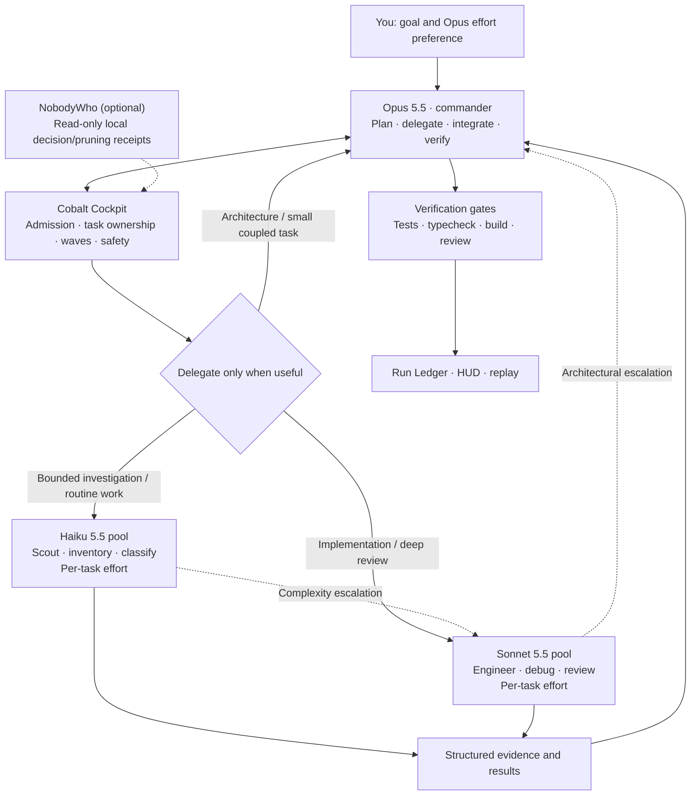

# Cobalt Cockpit v0.4.0 — Elastic Swarm + Adaptive Intelligence

**Mission control for Claude Code.** Follow real task progress, coordinate bounded subagents, review verification gates, and replay what happened, without replacing Claude Code's native model and permission controls.

[](https://github.com/echelong/cobalt-cockpit/tree/main)
[](https://github.com/echelong/cobalt-cockpit/actions/workflows/ci.yml)
[](LICENSE)

[Privacy](PRIVACY.md) · [Security](SECURITY.md)

## What it does

Cobalt Cockpit adds a cyberpunk HUD, orchestration controls, and a local Run Ledger to Claude Code. It tracks **observed** milestones and verification rather than inventing progress. With orchestration enabled, Opus coordinates bounded Sonnet engineering and Haiku utility tasks, each with task-aware reasoning effort. The dashboard itself makes no model calls.

## How the swarm works



Opus remains **one main commander** and keeps the reasoning effort you select in Claude Code. Sonnet handles well-scoped engineering and review; Haiku handles bounded reconnaissance and repetitive processing. Cockpit tracks ownership, dependencies, escalation, and evidence. It is not an independent model router or a guarantee that every available agent slot will be used.

**AUTO resource budgets:** up to 8 Sonnet, up to 16 Haiku, and **16 total subagents** under Cockpit's default admission policy. Actual Claude Code concurrency and model availability may be lower. Independent tasks can run in parallel; competing writers are serialized.

## Features

- VECTOR / Activity Field, milestone progress, verification-gated DONE, context usage and Git/activity tracking.
- Dynamic, task-aware reasoning effort: AUTO selection, a commander-named level per assignment, an operator ceiling and capability fallback, with requested and applied effort kept apart.
- Main and subagent orchestration telemetry, subagent radar, observed model/effort and token usage.
- Local Run Ledger, sanitized JSON export, bounded replay, and park/resume checkpoints.
- Blast-radius protection, repository hygiene, optional sounds and hot reload persistence.
- Fail-closed guards: a hook that cannot reach its decision refuses the action it guards rather than letting it run, and every such decision is judged against the event it was given.
- Narrow-terminal and reduced-motion layouts; preserves the engine's image viewer.
- Optional read-only NobodyWho telemetry and opt-in orchestration policy enforcement.
- Read-only helpers can deliver their reports: a bound helper may use the host's tool discovery and report hand-back without gaining any write, shell or delegation right, and each task records how its report arrived.

## Quick start

Requires Claude Code with mods/plugins enabled. **Claude Code 2.1.292+ is needed for native per-invocation subagent effort**; native subagent effort was live-tested on Claude Code 2.1.294. Check `claude --version` first. Older hosts have reduced effort observability and compatibility fallbacks.

Install from this repository's **public GitHub marketplace**:

```sh
claude plugin marketplace add echelong/cobalt-cockpit
claude plugin install cobalt-cockpit@cobalt-cockpit
```

Restart Claude Code, open `/cockpit`, and inspect `/cockpit version`. By default Cockpit **observes**; orchestration enforcement is opt-in.

To enable orchestration with the supported configuration CLI:

```sh
printf '%s\n' '{"orchestration":"true"}' | claude plugin configure cobalt-cockpit@cobalt-cockpit --values-stdin
```

Restart Claude Code again after changing settings. Enabling orchestration activates model/admission and ownership policy; it does not enable Fable blocking unless you also opt into `blockFable` or `cobaltStrict`.

**Updating an existing public-marketplace installation** (v0.3.2 or earlier):

```sh
claude plugin marketplace update cobalt-cockpit
claude plugin update cobalt-cockpit@cobalt-cockpit
```

Restart Claude Code and check `/cockpit version`. Your settings, preferences and saved Run Ledgers are kept; v0.4.0 adds no setting and changes no default.

The marketplace name in this repository is `cobalt-cockpit`. Some existing private/local setups use a separately registered marketplace alias such as `cobalt`; for those, use the identity shown by `claude plugin list` rather than copying the public suffix.

For development or a single-session trial:

```sh
git clone https://github.com/echelong/cobalt-cockpit.git
claude --plugin-dir /path/to/cobalt-cockpit
```

Disable or remove an installed copy:

```sh
claude plugin disable cobalt-cockpit@cobalt-cockpit
claude plugin uninstall cobalt-cockpit@cobalt-cockpit
```

A `--plugin-dir` copy stops loading when you omit the flag next session.

## Commands

| Command | Action |
| --- | --- |
| `/cockpit` | Open or close Mission Control |
| `/cockpit status` | Print current progress |
| `/cockpit auth` | Authentication and policy diagnostics, without credential values |
| `/cockpit mute` / `/cockpit unmute` | Persist sound preference |
| `/cockpit hud off` / `/cockpit hud on` | Persist HUD preference |
| `/cockpit reset` | Clear the current task |
| `/ledger` | Open local Run Ledger |
| `/ledger export json` | Print sanitized telemetry JSON |
| `/replay` | Browse successful edit/write snapshots |
| `/park` | Save a deterministic checkpoint for later resume |

## Orchestration

**Observation is the public default.** With `orchestration: false`, Cockpit observes your existing Claude Code activity without enforcing model routing, subagent budgets, Fable blocking, or subscription-only authentication. The bundled explorer/researcher/worker/reviewer agent definitions use Sonnet 5.5; scout/utility use Haiku 5.5.

Set **`orchestration: true`** to enforce the Opus/Sonnet/Haiku policy, independent pool resource budgets, and explicit task ownership. Orchestration does not by itself block Fable outside routed work. **`blockFable` is a separate opt-in**. **`cobaltStrict`** is an optional stricter preset that also blocks Fable/external advisor selection and requires subscription-style authentication. These models must be available to your account; Cockpit cannot grant model access.

The strict preset takes precedence over individual enforcement switches. NobodyWho remains optional and read-only: Cockpit observes its local receipts if configured; it does not install it or route requests to it.

### Elastic execution

Opus remains the single commander: architecture, planning, decomposition, integration, escalation decisions and final verification. Sonnet engineers substantial bounded changes and independent reviews. Haiku scouts repositories and processes extractive, repetitive work. Small or tightly coupled work stays in the main session.

The `swarm` tool records bounded assignments before spawning. Each assignment carries a task ID, parent, tier, semantic role, objective, scope, dependencies, resource ownership, read/write mode and spawn reason. Include the exact `[task:ID]` marker in the Agent description. Queued tasks wait for resource capacity; blocked tasks wait for dependencies; intersecting write scopes are serialized. Read-only scopes may overlap. Scoped agents use Read/Grep/Glob for inspection and Edit/Write for changes. Shell or custom tools require exclusive wildcard ownership; a narrow set of safe Git inspection commands remains available for wildcard read-only tasks. Path canonicalization fails conservatively to wildcard when unavailable. Resource budgets replace the old three-agent ceiling; AUTO provides backpressure rather than uncontrolled fan-out.

Run waves are reconnaissance → engineering → review → integration → verification. Waves are observable phases; they do not replace dependency checks. Haiku may escalate reasoning to Sonnet; Sonnet escalates ambiguity, architecture and high-risk changes to Opus. Handoffs preserve objectives, discoveries, evidence, unresolved questions, risk and next actions. Escalation is distinct from ordinary completion. Agents return concise conclusion/evidence/change/check/uncertainty artifacts; commanders verify claims independently.

`/cockpit` groups observed tiers, compresses pools larger than eight agents and reports task progress, queue, blockers, ownership conflicts and escalations. The Activity Field retains its crawler/spine identity and aggregates utility pools. The Run Ledger and replay explain assignment, spawn reason, wave, completion, escalation and verification. Escalated results remain unresolved after their host stops; the commander uses `swarm resolve` with evidence before dependent work can proceed. Queued dispatch stays under the commander through Agent, rather than automatic spawn loops. Active cancellation suppresses further model/tool actions and retains ownership until host termination is observed (the host exposes no stop API). For a running pre-v0.2 agent with unknown ownership, the commander explicitly assigns its scope then uses `swarm adopt` with the observed `agent_id`; until then further agent tool effects are held. Older ledgers default to an empty swarm; unavailable telemetry stays unknown. NobodyWho boundaries remain read-only.

```text
Opus 5.5          — commander / integration / final verification, at your /effort
  ├─ Sonnet 5.5     — 0..N bounded engineering and review, effort per task
  └─ Haiku 5.5      — 0..N scouts and utility work, effort per task
       escalation → Sonnet → Opus
Cobalt Cockpit — ownership / waves / backpressure / HUD / ledger / replay
NobodyWho     — local Decision / Pruning / read-only control telemetry
```

## Dynamic reasoning

Model selection and effort selection are separate decisions. The 5.5 tiers still command, engineer and scout. **You control the main Opus loop's effort; Cockpit manages the subagents'**, per task rather than fixed per tier.

- **AUTO** (default) names a level from the task: extractive inventories, classification and summaries run light; normal feature work, bug fixes and refactors run medium; complex debugging, concurrency, migrations, security analysis and high-risk architectural reasoning run high or xhigh; unusually difficult high-stakes reasoning may use max. A task that names no class falls back to its tier's baseline.
- A commander can name a level explicitly per assignment with the `swarm` tool's `effort` field (LOW / MEDIUM / HIGH / XHIGH / MAX, or AUTO). A named level wins AUTO. **MANUAL** mode instead honours the fixed per-tier levels and leaves Haiku unspecified.
- A task's level is *requested*, not guaranteed. The operator's `maxEffort` cap applies to subagents, and the host can apply its own limits. The Ledger distinguishes the requested level from the **engine-resolved** level and names a mismatch (`EFFORT FALLBACK`). This is host-resolution evidence, **not an independently captured wire receipt**. Unknown stays unknown.
- A subagent's level is set natively, on its own Agent call's `effort` parameter (Claude Code 2.1.292 or newer): one level per invocation, with no global setting for parallel agents to race on. It overrides the agent definition's `effort` frontmatter and a per-model `effortLevel` for that subagent only. The engine's own limits still win — `maxEffortLevel`, an organization's cap, `CLAUDE_CODE_EFFORT_LEVEL` and the model's support — and the level the engine resolves is what the ledger records as applied. When that is not the level asked for, the difference is named with both levels; it is never rewritten back.
- **The main loop's effort is never written by Cockpit.** A `turn.step` rewrite sits above everything in the engine's order (rewrite, then `CLAUDE_CODE_EFFORT_LEVEL`, then a session level from `/effort`, `--effort` or the model picker, then the settings' `effortLevel`, then the model's default, all under `maxEffortLevel`), and most of those cannot be seen from a plugin, so there is no way to offer a level *beneath* your own choice. The level the engine resolved is sent untouched and recorded as `engine`, with what was seen of its origin: the variable, a `/effort` typed this session, the settings, or `host` when none of those accounts for it. A cap that lowered your selection is named with both levels. AUTO and MANUAL, the `maxEffort` ceiling and every subagent launch leave it alone. With no selection of your own the main loop runs at the host's default for the model, which is not necessarily the level AUTO would name: `/cockpit version` then says what AUTO would name, as advice, and `/effort <level>` sets it.
- A subagent on an older engine, or one that no Agent call launched, gets its level from a per-request `turn.step` rewrite instead. The engine does not report that rewrite back, so there the ledger shows the level as *requested* (`request`), leaves *observed* unknown, and learns nothing about capability from the engine's reports.
- A failing task escalates one step at a time: raise effort within the tier first, then move a tier (Haiku → Sonnet → Opus). It never jumps to the top and stops at the budget rather than retrying forever.

The HUD shows the applied effort beside the model; `/cockpit version` prints the reasoning mode, the ceiling, the main loop's host-resolved level and where it was seen to come from, how a subagent's level reaches the engine, and only the capability this session has really observed.

## HUD states

| State | Meaning |
| --- | --- |
| IDLE | No active work |
| SCAN | Main loop working without a tool in flight |
| ACTIVE | Tool or agent activity observed |
| QUERY | Waiting on a question put to you, or on one of Cockpit's own asks. Claude Code's permission dialog is not tracked |
| FAULT | Failure or blocker |
| VERIFIED | Milestones complete and required gates satisfied |

A completed turn does not complete a task. Missing measurements stay unknown.

## Run Ledger

Ledger records observed runs, agents, tools, usage, verification and optional local-control receipts. It keeps up to eight sessions in the host's plugin store, with a 384,000-byte budget per stored ledger and bounded detail windows. Live agents and originating runs are retained; oldest detail is evicted first. `/park` stores phase, explicit goal/milestones, blockers and Git checkpoint data. Resuming the same session restores its checkpoint; this is not an automatic new-session handoff or model summary.

Replay retains at most 24 snapshots, with a 96,000-character aggregate budget and 12,000-character per-step budget. Sensitive filenames, detected credentials and oversized content are omitted. JSON export excludes snapshot bodies, agent descriptions and checkpoint prose. It includes sanitized structured task assignments, ownership, results and lifecycle evidence.

## Safety

Blast-radius protection asks before recognized destructive shell commands. Repository hygiene checks attribution and unsolicited instruction-file creation. These guards supplement Claude Code permissions; they are heuristic and cannot recognize every shell program or obfuscated command. Verification gates use observed exit status and explicit reported evidence, not proof of correctness.

Cockpit does not take part in Claude Code's permission check. It registers no hook on it and makes no permission query; its guards run before it and can only refuse a call or ask you about it, never approve one.

### Sonnet-led profile

`profile: SONNET_LED` (with orchestration enforced): **Sonnet builds. Haiku scouts. Opus reviews. NobodyWho advises.**

- The main loop is requested on Sonnet 5.5 at your own effort (`/effort`, settings, `modelSettings`); Cockpit never rewrites that effort.
- Haiku scouts and Sonnet workers run as before. AUTO budgets are conservative: 4 helpers in all, 2 Sonnet, 2 Haiku and 1 Opus within them. Explicit `maxSubagents`/pool values still win.
- Opus 5.5 is never the main loop and never a background model. The main session requests it with `swarm action consult`: a ground (`architecture`, `security`, `repeated-failure`, `asked`, `release`) and a concise evidence packet (objective, architecture, files, alternatives, failures, risk, decision). Cockpit admits it only where the ground holds on evidence: a large or spread change, or architecture named in the prompt; security-sensitive files or a security prompt; the same failure three times in a row; an explicit request for Opus; a release approval. One Opus at a time, an unchanged problem consulted once, one retry after a failed run, three per task. The admitted consultation runs as `cobalt-cockpit:architect` (read-only, Opus, high effort) and returns a structured decision; Sonnet implements and verifies it.
- Opus cannot be reached around this: an unassigned Agent call naming Opus or the architect, an `assign` of tier OPUS, or the architect on a Sonnet task is refused.
- Mandatory consultations: an explicit request for Opus, a release approval, or a change to security-sensitive files (auth, secrets, credentials, permissions, policy, guards, `.env`, keys) holds the task below 100% until a consultation has returned and the main session has verified its advice with `swarm action verify` (pass or fail, with evidence). Review findings are advice until verified.
- NobodyWho advises: with `localAdvice` on, each consultation request asks the local router (`decision ask --caller cockpit`). Its answer is recorded beside the consultation only with a real receipt id, and never decides admission. Unavailable advice degrades to deterministic admission.
- HUD and Ledger name the roles (MAIN, SCOUT, ENGINEER, ARCHITECT, LOCAL CONTROL), list each consultation with its ground, whether it returned, its decision and Sonnet's verification, and report host-reported tokens per tier. Requests without usage figures are counted as unreported; nothing is estimated. `/ledger` shows the host's `/cost` total where it keeps one.
- Context: set Sonnet's compaction window natively (`/autocompact 400k`, stored as `modelSettings["claude-sonnet-5-5"].autoCompactWindow`). Cockpit does not compact or change settings. Subagents keep their own model defaults.

`OPUS_LED` remains the default and behaves exactly as before. Migration and rollback are in [docs/implementation-v0.5-sonnet-led.md](docs/implementation-v0.5-sonnet-led.md).

## NobodyWho integration

Optional and read-only. By default, Cockpit checks `$XDG_STATE_HOME/decision-router/ledger.jsonl`, or `$HOME/.local/state/decision-router/ledger.jsonl`. Set `ledgerPath` to override it; set `localControl` false to stop reading.

Only `caller: "claude"` receipts arriving after startup are shown. Decision comes from an `ask` receipt; Pruning comes from a `prune` receipt. They stay separate. Missing, malformed or unavailable ledgers are silent; LOCAL CONTROL is omitted when nothing is observed. There is no fake activity, JEV integration, cloud fallback or dependency on local control. Raw prompts, hidden reasoning, receipt details and credential values are not copied into this adapter's telemetry.

## Configuration

Use `/config` or `claude plugin configure cobalt-cockpit@cobalt-cockpit` to inspect options. CLI input values are strings, even for Boolean options:

```sh
# Full opt-in policy: orchestration plus Fable and external-advisor blocking
printf '%s\n' '{"cobaltStrict":"true"}' | claude plugin configure cobalt-cockpit@cobalt-cockpit --values-stdin
```

Restart Claude Code after changing configuration. To enable just Fable blocking alongside orchestration, configure `blockFable: true` separately. No external router is required.

| Option | Public default |
| --- | --- |
| `hud`, `animation`, `sounds` | true |
| `volume` | 0.6 |
| `blastRadiusGuard`, `attributionGuard` | true |
| `reducedMotion` | false; `COBALT_REDUCED_MOTION=1` also disables motion |
| `localControl` | true, optional detection |
| `ledgerPath` | empty, resolves from the environment |
| `orchestration` | false (observe); true enforces model/admission policy |
| `maxSubagents` | 0 = AUTO (16 total); explicit resource budget 1–128 |
| `maxSonnetAgents`, `maxHaikuAgents` | -1 = AUTO (8 Sonnet / 16 Haiku); 0 disables a pool; subject to total budget |
| `blockFable`, `subscriptionOnly`, `cobaltStrict` | false |
| `reasoningMode` | `AUTO`; `MANUAL` honours fixed per-tier levels for subagents; the main loop's effort stays yours |
| `maxEffort` | `max`; lower ceilings cap every subagent request and are recorded |
| `profile` | `OPUS_LED` (legacy: Opus main loop); `SONNET_LED` runs the main loop on Sonnet and consults Opus on admission |
| `localAdvice` | true; `SONNET_LED` only: ask the local NobodyWho router for advisory input on a consultation |

## Compatibility

Linux and macOS terminals use standard text/Braille rendering; Kitty or WezTerm is not required. Narrow widths drop detail progressively. Desktop uses SVG where available; terminal retains text/Raster equivalents. Core commands and guards do not need desktop graphics. Image viewing delegates to Claude Code.

Sounds try PipeWire, PulseAudio, ALSA, ffplay, mpv, SoX, Canberra, macOS afplay, then a terminal bell. Missing/failing players fall back to silence. `/cockpit mute` disables cues. macOS behavior is covered by the engine test harness, not a physical macOS run. Windows is not tested. Mods may be disabled by organizational policy; this dashboard is intended for Claude Code, not claude.ai/Cowork.

## Privacy

Run Ledger is local. Cockpit observes tool calls, paths, agent events, token/context telemetry, Git state and verification. In-session task state can contain user text; persisted checkpoints retain explicit goals and milestone labels. Hidden reasoning is never stored. Redaction is heuristic: review exports before sharing, and never export secrets. The full policy is in [PRIVACY.md](PRIVACY.md); see also [SECURITY.md](SECURITY.md).

### What Cockpit runs, reads and sends

Cockpit installs no launcher and downloads nothing. It runs local processes, with your privileges and without prompting, for five reasons: `realpath -m` canonicalizes a path a subagent claims as its own (orchestration only), `tail -c` reads the end of a telemetry ledger larger than 512 KiB, `git status --porcelain=v2` and `git rev-parse --show-toplevel` feed the HUD, one of nine audio players plays the optional cues (`pw-play`, `paplay`, `aplay`, `ffplay`, `mpv`, `play`, `canberra-gtk-play`, `afplay`, then a terminal bell), and in the `SONNET_LED` profile with `localAdvice` on, `decision ask --caller cockpit` asks the local NobodyWho router for advice when an Opus consultation is requested. Each is an argument array: no shell string is ever built from model or user text.

It reads files: the decision-router ledger (read-only, optional, `localControl`), a file about to be written (a bounded replay snapshot), and Claude Code's settings. It reads environment variables **by name**: `CLAUDE_CODE_EFFORT_LEVEL`, `XDG_STATE_HOME`, `HOME`, `COBALT_REDUCED_MOTION`, and eight authentication variables — `ANTHROPIC_API_KEY`, `ANTHROPIC_AUTH_TOKEN`, `ANTHROPIC_BASE_URL`, `ANTHROPIC_CUSTOM_HEADERS`, `CLAUDE_CODE_USE_BEDROCK`, `CLAUDE_CODE_USE_VERTEX`, `CLAUDE_CODE_USE_FOUNDRY`, `CLAUDE_CODE_USE_MANTLE` — whose values are reduced to set-or-not-set on the spot and never stored, logged, exported or sent. It writes nothing outside the host's plugin store, which holds up to eight bounded run ledgers, bounded replay bodies, checkpoints and two preferences.

It makes no network request of its own: no fetch, no model call, no MCP call. Its two prompt hooks add text to the request Claude Code already sends — the discipline, safety and policy sections of the system prompt, and one line of task status — which is the only route by which anything Cockpit observed reaches a model. Every path above is listed with its call site in [docs/implementation-v0.3.2.md](docs/implementation-v0.3.2.md).

The guards are not a sandbox: they use recognizable syntax and your confirmation. Keep Claude Code's permission controls enabled.

## Development

Load the folder once with `claude --plugin-dir /path/to/cobalt-cockpit` to generate the host API declarations. TypeScript 5.4+ is needed for type checking; Python 3 runs the portability audit. The suite's default host version is 2.1.288, and the native-effort and directory-validation paths are exercised at 2.1.294.

```sh
claude plugin validate --strict .
claude plugin validate --strict .claude-plugin/plugin.json
claude plugin validate --strict agents
claude plugin test .
tsc -p .
python3 scripts/audit-public.py
python3 scripts/make-icon.py    # re-render the listing icon from the HUD portrait
```

All fixtures are synthetic. Test with an isolated HOME/config/state directory. Do not use a real telemetry ledger or private session capture in fixtures.

## License

MIT. Adapted work and required upstream MIT notices are preserved in [THIRD_PARTY_NOTICES](THIRD_PARTY_NOTICES).

## Optional companion: memory and browser

Cockpit is complete on its own: it needs no memory service, no browser, no database and no extra inference, and this repository contains none of that code.

[`cobalt-capabilities`](https://github.com/echelong/cobalt-capabilities) is a separate plugin, in its own repository with its own releases, for people who want explicit project memory (through a Hindsight service they run) or bounded browser evidence (through an Obscura service they run) alongside Cockpit v0.4.0 or later. It is not installed with Cockpit, both of its capabilities are off until configured, and its privacy and security documentation is its own. Install instructions and limits are in that repository's README.
